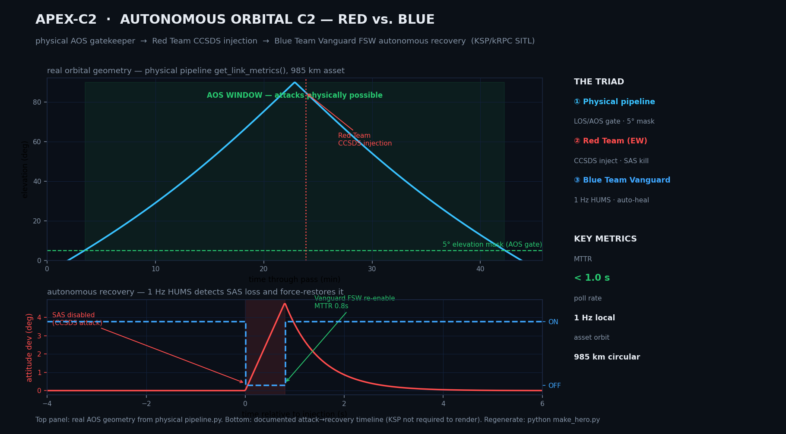

# Operation Phoenix Vanguard: Autonomous Orbital C2 and Recovery

## Overview

This repository contains the Phase 1 architecture for a Software-in-the-Loop (SITL) simulation designed to test autonomous satellite self-healing in a contested command and control (C2) environment. The primary objective is to demonstrate that on-board, local-first logic can detect and recover from adversarial command injections faster than traditional ground-based human-in-the-loop systems.

By utilizing Kerbal Space Program (KSP) via kRPC as a high-fidelity physics surrogate, this project models realistic orbital mechanics, signal degradation, and hardware constraints.

*Top panel: real orbital geometry from `physical-range/physical pipeline.py` (`get_link_metrics`) — the AOS window is the only time the Red Team may inject. Bottom panel: the documented attack → autonomous-recovery sequence (SAS disabled, Vanguard FSW restores it, MTTR < 1s). Regenerate with `python make_hero.py`.*

## System Architecture: The Triad

The environment is built on a tripartite architecture, ensuring that adversarial tests are constrained by the physical realities of spaceflight.

### 1. The Physical Pipeline (LOS/AOS Gatekeeper)

Ground-to-space links are not persistent. This module calculates real-time elevation masks (enforcing a standard 5.0-degree minimum) and slant range to determine Line-of-Sight (LOS) and Acquisition of Signal (AOS). It actively prevents "phantom attacks" by ensuring the adversarial node only transmits when orbital geometry allows for signal penetration.

### 2. Red Team: Adversarial Simulation Node

This component acts as the hostile ground station. When the Physical Pipeline reports an open AOS window, the Red Team node generates and injects malicious CCSDS (Consultative Committee for Space Data Systems) formatted frames into the telemetry stream. Phase 1 specifically targets the spacecraft's stability controls (e.g., disabling the SAS to induce an uncontrolled tumble).

### 3. Blue Team: Vanguard FSW & RTA Sandbox

The core intellectual property of the project. This is a local-first Flight Software (FSW) parser and Real-Time Analytics (RTA) sandbox residing "on the asset." Operating on a 1Hz polling loop, it monitors critical telemetry (such as power draw and gyroscopic stability) and utilizes isolated logic gates to detect unexpected state changes. Upon detecting a breach, it executes an autonomous recovery protocol to restore hardware integrity.

## Key Performance Metrics

* **Hardware Surrogate:** GPS III Satellite in a 985km circular orbit.
* **Control Loop Frequency:** 1Hz local telemetry polling.
* **Mean Time to Recovery (MTTR):** < 1.0 seconds. The Vanguard system successfully identifies command-injection anomalies and restores stable flight parameters before mission-critical deviation occurs.

## Tech Stack

* **Python 3.x:** Core simulation logic and orchestration.
* **kRPC:** Telemetry extraction and command injection interface.
* **KSP Engine:** Physics, orbital mechanics, and hardware state surrogate.

## Future Work

### Phase 2: Synthetic Electronic Warfare (EW) Range

The next iteration of Phoenix Vanguard will transition from discrete command injection testing to a continuous Electronic Warfare (EW) environment. Planned implementations include:

* **Synthetic Signal Degradation:** Developing a mathematical model to simulate Barrage Jamming (white noise flooding to degrade the Signal-to-Noise Ratio) and Smart Spoofing (injecting rhythmic false telemetry).
* **Advanced Countermeasures:** Upgrading the Vanguard HUMS to not only detect anomalies but classify the attack vector, triggering physical simulated countermeasures such as RF decoys or frequency hopping logic.
* **Cryptographic OPSEC:** Hardening the SITL range itself by implementing AES-256 encryption and mutual TLS (mTLS) on the telemetry pipes to enforce zero-trust principles during testing operations.